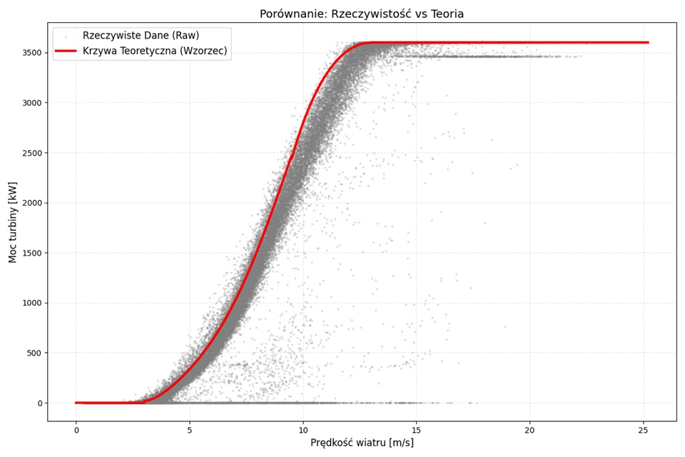
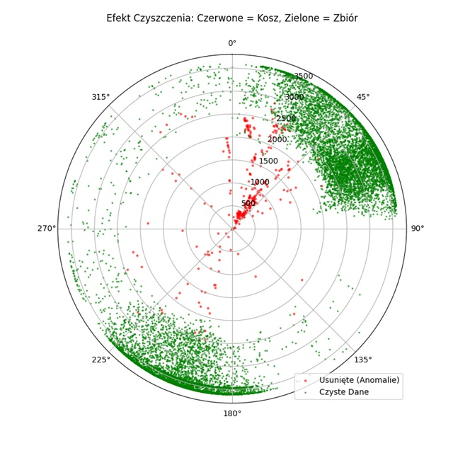
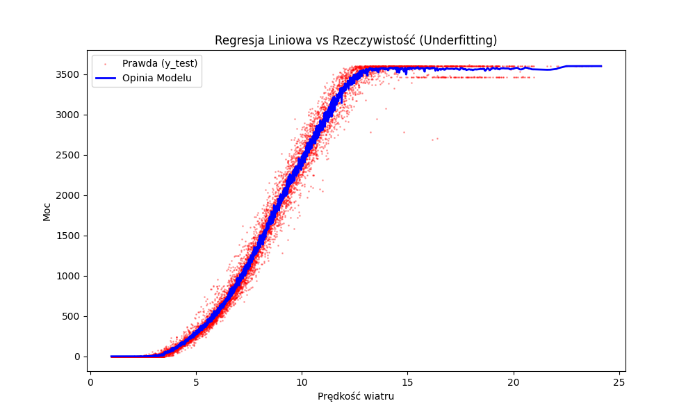
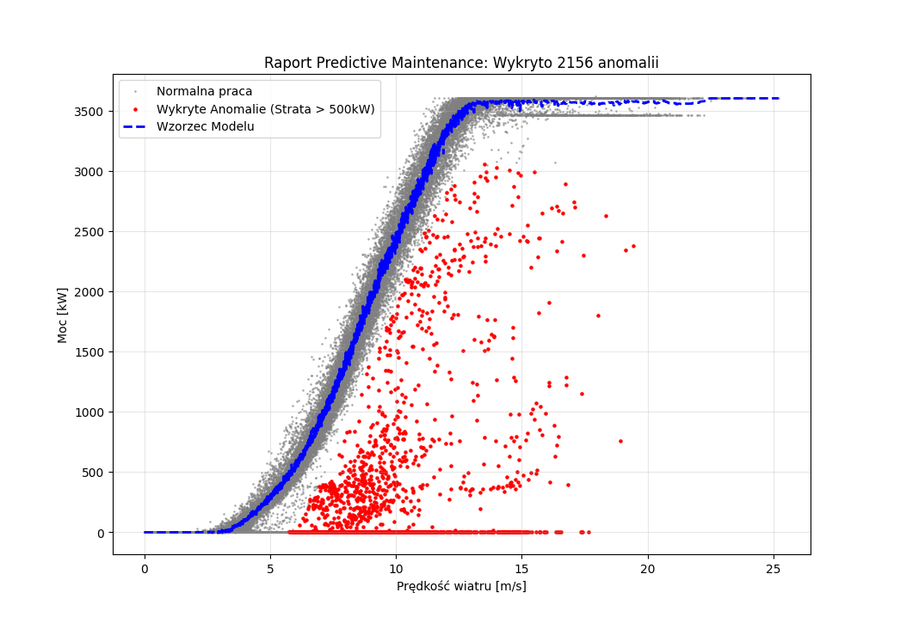

# Wind Guardian: SCADA Data Cleaning & Anomaly Detection

**Data Engineering Project for Renewable Energy Sources (RES)**

## About the Project

The goal of this project was to transform raw, noisy wind turbine data (SCADA system) into a **Golden Dataset**, ready for training Machine Learning models (specifically for **Predictive Maintenance**).

Analyzing wind data is challenging due to the non-linear characteristics of turbines (Power Curve) and numerous external anomalies (weather conditions, grid curtailments, sensor faults). This project focuses on **statistical and physical data cleaning** to separate actual component failures from natural wind variability and environmental factors.

## Business Value

Training AI models on raw data leads to the **"Garbage In, Garbage Out"** problem. A model trained on data containing service stops or sensor errors will generate false alarms, leading to unnecessary maintenance costs.

**Objective:** Automatically identify and remove:
* **Curtailments**: Deliberate power reductions imposed by the grid operator.
* **Sensor Errors**: Measurement faults (e.g., frozen anemometers).
* **Wake Effect**: Power losses caused by the aerodynamic shadow of neighboring turbines or terrain obstacles.

## Methodology (Data Cleaning Pipeline)

A multi-stage filtration process based on turbine physics and statistics was applied:

### 1. Exploratory Data Analysis (EDA)
Comparison of raw data against the manufacturer's **Theoretical Power Curve**. Identified significant "underperformance" clusters below the curve.

### 2. Physical Filtration (Zero Power)
Removal of data points where **Wind Speed > 3.5 m/s** (Cut-in speed) but **Power ≤ 0**. These represent clear downtimes, maintenance stops, or system failures.

### 3. Statistical Filtration (Binning & Probabilistic Filter)
Applied **Binning technique** to wind speed (intervals of 0.5 m/s). For each bin, the **Mean** and **Standard Deviation** (σ) were calculated.

* **Criterion**: Data points where **Power < (Mean - 2σ)** were rejected.
* **Logic**: This adaptive threshold removes "underperforming" anomalies (drag, ice, errors) while preserving high-performance data (points above the mean), ensuring the model learns the turbine's full potential.

### 4. Wake Effect Analysis
Used **Polar Plots** to verify the cleaning quality and identify environmental constraints.

* **Discovery**: A strong power drop was identified in the **10°-80° sector** (North-East), indicating a significant **Wake Effect** (likely from a neighboring turbine).
* **Solution**: The statistical filter (Step 3) successfully detected and removed these compromised data points automatically, without the need for hard-coded sector exclusion.

## Key Results

The Polar Plot below demonstrates the algorithm's effectiveness:

* 🔴 **Red dots**: Data rejected by the algorithm (mostly the 10°-80° Wake Effect sector and random outliers).
* 🟢 **Green dots**: The Clean "Golden" Dataset (forming a perfect ring at high wind speeds).

## Tech Stack

* **Python** (Core logic)
* **Pandas** (Data manipulation, Binning, Merge, Groupby)
* **Matplotlib / Seaborn** (Engineering visualizations, Polar plots)
* **NumPy** (Vectorized calculations)
-----------------------------------------------------------------------------------------------------------------------

Phase 2: Machine Learning & Predictive Maintenance

After establishing the Golden Dataset, the project moved into the modeling phase with the goal of creating a Digital Twin of the wind turbine.

1. Model Selection & Training

The initial approach using Linear Regression proved insufficient, as it failed to capture the non-linear S-shaped power curve characteristic of turbine behavior.
To address this, the model was upgraded to a Random Forest Regressor.

Algorithm: Random Forest (Ensemble Learning)

Hyperparameters:

max_depth

min_samples_leaf
Tuned to reduce overfitting while preserving sensitivity to subtle variations in the power curve.

Performance

R² Score: 0.99
The model explains 99% of the variance in turbine power output.

MAE: ~70 kW
Average prediction error below 2% of the turbine’s maximum capacity.

2. Anomaly Detection System (The “Judge”)

The trained model was used to simulate ideal turbine behavior on historical raw data, including data points previously rejected during cleaning.

Logic:

Deviation
=
Actual Power
−
Predicted Power
Deviation=Actual Power−Predicted Power

Threshold:
Deviations lower than -500 kW were flagged as anomalies.

This approach allows the model to act as a reference baseline, identifying significant underperformance relative to expected behavior.

3. Business Results

The anomaly detection system automatically identified 2,156 incidents of underperformance, categorized into:

Downtimes:
High wind conditions with zero power output (total production loss).

Curtailments / Derating:
Turbine operating at reduced, partial capacity.

Sensor or Component Faults:
Subtle deviations indicating issues such as icing or turbine misalignment.

